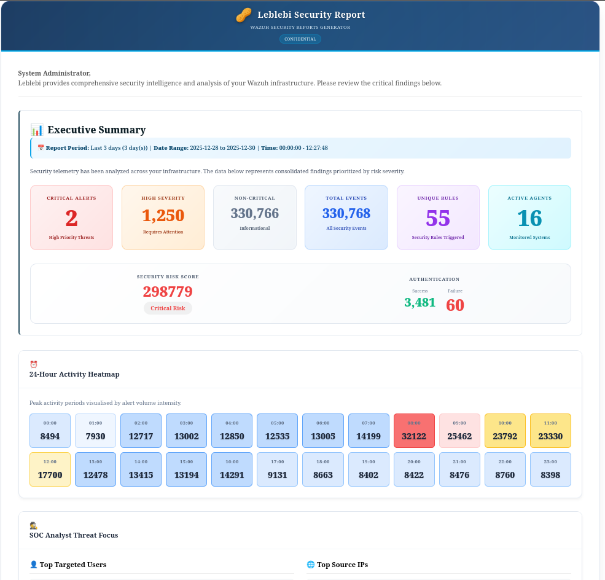
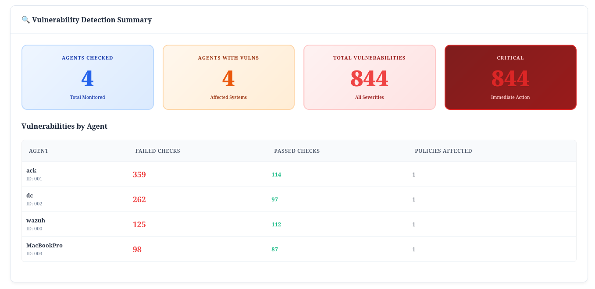
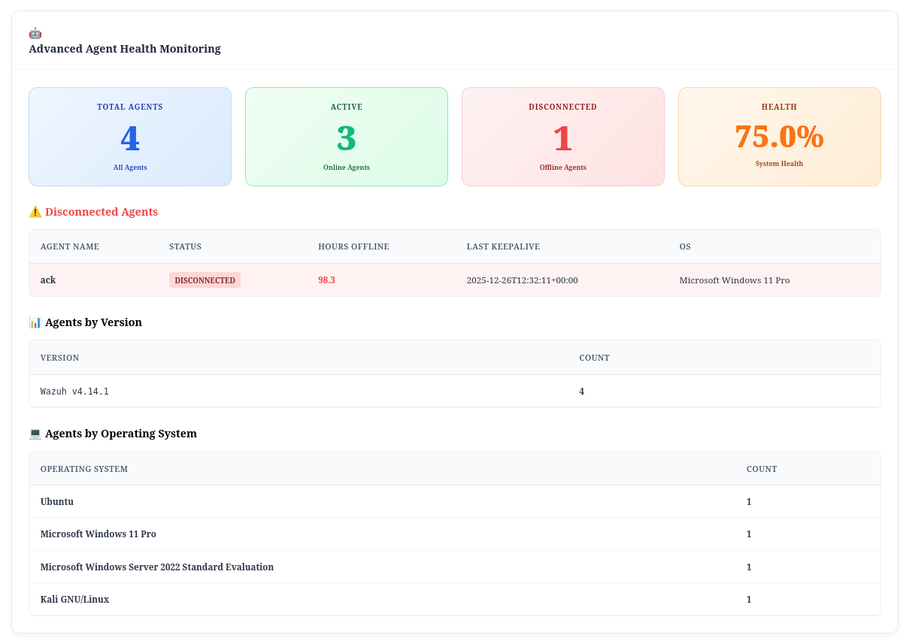

# Leblebi - Wazuh Security Reports Generator

<div align="center">
  
  
  
  <h2>🥜 Comprehensive Security Intelligence and Reporting Tool for Wazuh SIEM</h2>
  
</div>

<div align="center">
  <a href="https://github.com/cumakurt/leblebi">
    
  </a>
  <a href="https://github.com/cumakurt/leblebi">
    
  </a>
</div>

<div align="center">
  [English](#english) | [Türkçe](#türkçe)
</div>

---

## English

### Overview

Leblebi is a comprehensive, production-ready security intelligence and reporting tool for Wazuh SIEM. It generates detailed HTML security reports by analyzing Wazuh alerts, system information, and API data. The tool provides executive summaries, threat intelligence, agent health monitoring, MITRE ATT&CK mapping, vulnerability detection, and comprehensive security analysis.

### Product Screenshots

<div align="center">
  
  <h3>📊 Report Dashboard & Executive Summary</h3>
  
  
  <h3>🔍 Security Analysis & Monitoring</h3>
  
  
  <h3>🛡️ MITRE ATT&CK & Vulnerability Detection</h3>
  
  
  <h3>🤖 Agent Health & System Monitoring</h3>
  
  
</div>

### Key Features

<div align="center">
  
</div>

- **Comprehensive Alert Analysis**: Processes alerts from `alerts.json` with time-based filtering and multi-day support
- **Risk Scoring**: Calculates security risk scores based on alert severity and frequency
- **MITRE ATT&CK Framework**: Automatic mapping of alerts to MITRE tactics, techniques, and APT groups
- **Vulnerability Detection**: CVE analysis, patch priority recommendations, and SCA compliance reporting
- **Event Correlation**: Identifies related security events within time windows
- **Agent Health Monitoring**: Real-time agent status via Wazuh API (optional)
- **Rootcheck Analysis**: System integrity checks and rootkit detection
- **Windows Event Analysis**: Detailed Windows security event tracking
- **HTML Reports**: Beautiful, modern HTML reports with visualizations
- **Email Notifications**: Automated email delivery of reports
- **Thread-Safe Logging**: Production-ready logging system
- **Performance Optimized**: Handles large log files (200GB+ daily) with streaming parsers and sampling
- **Professional Architecture**: Service layer, factory pattern, command pattern, retry mechanisms

### Architecture

Leblebi follows professional software architecture patterns:

- **Service Layer Pattern**: Business logic separated into service classes (`APIService`, `ReportService`, `SystemInfoService`, `AlertProcessingService`)
- **Factory Pattern**: `WazuhAPIFactory` for creating and managing API client instances
- **Command Pattern**: CLI commands implemented as command classes
- **Custom Exception Hierarchy**: Proper error handling with specific exception types
- **Retry Mechanism**: Automatic retry for API calls with exponential backoff
- **Configuration Management**: Centralized configuration with validation

### Requirements

- Python 3.8 or higher
- Wazuh Manager installed
- Access to Wazuh alerts.json file
- (Optional) Wazuh API access for advanced features
- (Optional) `ijson` package for streaming JSON parsing (recommended for large files)
- (Optional) `psutil` package for memory monitoring

### Installation

1. Clone the repository:
```bash
git clone https://github.com/cumakurt/leblebi.git
cd leblebi
```

2. Install dependencies:
```bash
pip install -r requirements.txt
```

3. Create configuration file:
```bash
cp config.conf.example config.conf
# Edit config.conf with your settings
# IMPORTANT: Update email addresses, SMTP settings, and API credentials
```

### Configuration

Edit `config.conf` with your settings. See `config.conf` for detailed documentation of all options.

Key configuration sections:
- **Alert Filtering**: Alert level threshold, top alerts count
- **Directories**: Log directory, output directory
- **Email**: SMTP server, recipients, authentication
- **Logging**: Log level, log file path
- **Wazuh API**: API connection settings (optional)
- **Performance**: Memory limits, sampling, streaming parser settings
- **Report Period**: Time period for report generation (e.g., 1d, 7d, 30d)

### Usage

#### Basic Usage

Generate a daily security report:
```bash
python3 leblebi.py
```

#### Command Line Options

```bash
python3 leblebi.py [OPTIONS]

Options:
  -c, --config PATH      Path to configuration file
  -v, --verbose          Enable verbose logging (DEBUG level)
  -q, --quiet            Enable quiet mode (ERROR level only)
  -d, --dry-run          Generate report but do not send email
  --test                 Test mode: Generate report in current directory without sending email
  --log-file PATH        Path to log file
  --alerts-file PATH     Path to alerts.json file (overrides config)
  --apitest              Test Wazuh API connection
  --config-test          Test configuration, log file, API connection, and email sending
```

#### Examples

Test API connection:
```bash
python3 leblebi.py --apitest
```

Test configuration:
```bash
python3 leblebi.py --config-test
```

Generate report in test mode (no email):
```bash
python3 leblebi.py --test
```

Generate weekly report (last 7 days):
```bash
# Edit config.conf: report_period = 7d
python3 leblebi.py
```

Use custom alerts file:
```bash
python3 leblebi.py --alerts-file /path/to/alerts.json
```

### Report Periods

The `report_period` setting uses a flexible format: `Nd` where `N` is the number of days.

Examples:
- **1d**: Today only
- **2d**: Last 2 days (today + yesterday)
- **3d**: Last 3 days
- **7d**: Last 7 days (weekly)
- **14d**: Last 14 days
- **30d**: Last 30 days

**Note**: If log files for the requested number of days are not available, the application will:
- Process available log files
- Display a warning message showing which dates are missing
- Continue with the report generation using available data

### Report Contents

- **Executive Summary**: High-level overview of security posture
- **Security Risk Score Dashboard**: Visual risk assessment
- **Hourly Activity Heatmap**: Time-based alert distribution
- **SOC Analyst Threat Focus**: Critical alerts for immediate attention
- **Windows User Account Activity**: User authentication and account events
- **Critical Alerts Summary**: Detailed breakdown of high-severity alerts
- **Top Alerting Agents**: Agents generating most alerts
- **Alert Categories Distribution**: Alert type analysis
- **MITRE ATT&CK Framework Analysis**: Tactics, techniques, and APT group mapping
- **Vulnerability Detection**: CVE analysis and patch recommendations
- **Event Correlation Analysis**: Related security events grouped by correlation keys
- **Windows Event IDs**: Windows-specific security events
- **Agent Health Monitoring**: Real-time agent status (if API enabled)
- **Rootcheck Analysis**: System integrity and rootkit detection (if API enabled)
- **Security Recommendations**: Actionable security advice

### Sample Report Output

A complete example HTML report is available in the repository:

📄 **[View Sample Report](sample_report.html)** - Complete example of Leblebi security report output

This sample report demonstrates all features including:
- Executive summary with risk scoring
- Visual dashboards and charts
- MITRE ATT&CK framework analysis
- Vulnerability detection summaries
- Agent health monitoring
- Security recommendations

You can open `sample_report.html` in any web browser to see the full report structure and styling.

### API Features (Optional)

When Wazuh API is enabled, Leblebi provides:

- **Agent Health Monitoring**: Real-time agent status, disconnected agents, version distribution, OS distribution
- **SCA (Security Configuration Assessment)**: Policy compliance results and scores
- **Syscheck (FIM)**: File integrity monitoring findings
- **Rootcheck Analysis**: System integrity and rootkit detection results
- **Syscollector Data**: Hardware, network, packages, ports, processes
- **CIS-CAT Compliance**: Benchmark compliance results
- **Manager Statistics**: Wazuh manager performance metrics
- **MITRE ATT&CK Enrichment**: Automatic mapping of alerts to MITRE framework
- **Vulnerability Detection**: CVE analysis and patch priority recommendations

### Performance Features

Leblebi is optimized for large-scale environments:

- **Streaming JSON Parser**: Uses `ijson` for memory-efficient processing of large files
- **Sampling**: Configurable sampling rate for extremely large datasets
- **Memory Monitoring**: Automatic memory limit checking with `psutil`
- **Parallel API Collection**: Concurrent API requests for faster data collection
- **Configurable Limits**: Adjustable limits for alerts, agents, and data collection
- **Time-based Filtering**: Early filtering to reduce memory usage

### File Structure

```
leblebi/
├── leblebi.py              # Main entry point
├── config.conf              # Configuration file
├── requirements.txt         # Dependencies
├── README.md                # This file
├── img/                     # Images directory
│   ├── leblebi.png          # Main logo
│   └── leblebi2.png         # Secondary logo
└── leblebi/                 # Package directory
    ├── __init__.py
    ├── alerts.py            # Alert processing
    ├── agent_health.py      # Agent health monitoring
    ├── api_collector.py     # Parallel API data collection
    ├── commands.py          # Command pattern implementation
    ├── config.py            # Configuration management
    ├── email.py             # Email sending
    ├── exceptions.py        # Custom exception hierarchy
    ├── factory.py            # Factory pattern for API clients
    ├── logger.py            # Logging system
    ├── mitre_enrichment.py  # MITRE ATT&CK enrichment
    ├── reporting.py         # HTML report generation
    ├── retry.py             # Retry mechanism
    ├── services.py          # Service layer (APIService, ReportService, etc.)
    ├── system_info.py       # System information collection
    ├── utils.py             # Utility functions
    ├── vulnerability_detection.py  # Vulnerability detection
    ├── wazuh_api.py         # Wazuh API client
    └── windows_events.py     # Windows event ID mappings
```

### Troubleshooting

#### Alerts file not found

Ensure `alerts.json` is accessible in one of these locations:
- `/var/ossec/logs/alerts/alerts.json`
- `<log_dir>/alerts.json` (from config)
- `./alerts.json` (current directory)
- Or use `--alerts-file` option

#### API connection failed

1. Verify Wazuh API is running: `systemctl status wazuh-api`
2. Check API credentials in `config.conf`
3. Test connection: `python3 leblebi.py --apitest`
4. Verify network connectivity and firewall rules
5. Check SSL certificate settings if using HTTPS

#### No alerts in report

- Check if alerts exist in the selected time period
- Increase `report_period` (e.g., 7d or 30d)
- Verify alerts.json file contains data
- Check file permissions
- Review log files for errors

#### Memory issues with large files

- Enable `sampling_enabled = true` in config
- Set `max_alerts_to_process` limit
- Install `ijson` for streaming parser: `pip install ijson`
- Set `memory_limit_mb` to enable automatic sampling
- Reduce `report_period` to process fewer days

#### Performance optimization

- Use `ijson` for streaming JSON parsing (install: `pip install ijson`)
- Enable sampling for very large files (>2GB)
- Adjust `api_max_workers` for parallel API collection
- Set `max_agents_to_collect` to limit agent data collection
- Configure appropriate timeouts in performance section

### Contributing

Contributions are welcome! Please follow these guidelines:

1. Fork the repository
2. Create a feature branch
3. Make your changes
4. Test thoroughly
5. Submit a pull request

### License

This project is licensed under the GNU General Public License v3.0 (GPL-3.0). See [LICENSE](LICENSE) file for details.

### Support

For issues, questions, or contributions, please open an issue on [GitHub](https://github.com/cumakurt/leblebi/issues).

### Developer

**Developer:** Cuma KURT  
**GitHub:** [https://github.com/cumakurt/leblebi](https://github.com/cumakurt/leblebi)  
**LinkedIn:** [https://www.linkedin.com/in/cuma-kurt-34414917/](https://www.linkedin.com/in/cuma-kurt-34414917/)

---

## Türkçe

<div align="center">
  
</div>

### Genel Bakış

Leblebi, Wazuh SIEM için kapsamlı, production-ready bir güvenlik istihbarat ve raporlama aracıdır. Wazuh uyarılarını, sistem bilgilerini ve API verilerini analiz ederek detaylı HTML güvenlik raporları oluşturur. Araç, yönetici özetleri, tehdit istihbaratı, ajan sağlık izleme, MITRE ATT&CK eşleme, güvenlik açığı tespiti ve kapsamlı güvenlik analizi sağlar.

### Ürün Ekran Görüntüleri

<div align="center">
  
  <h3>📊 Rapor Dashboard & Yönetici Özeti</h3>
  
  
  <h3>🔍 Güvenlik Analizi & İzleme</h3>
  
  
  <h3>🛡️ MITRE ATT&CK & Güvenlik Açığı Tespiti</h3>
  
  
  <h3>🤖 Ajan Sağlığı & Sistem İzleme</h3>
  
  
</div>

### Temel Özellikler

<div align="center">
  
</div>

- **Kapsamlı Uyarı Analizi**: Zaman bazlı filtreleme ve çoklu gün desteği ile `alerts.json` dosyasından uyarıları işler
- **Risk Skorlama**: Uyarı önem derecesi ve sıklığına göre güvenlik risk skorları hesaplar
- **MITRE ATT&CK Framework**: Uyarıların MITRE taktikleri, teknikleri ve APT gruplarına otomatik eşlenmesi
- **Güvenlik Açığı Tespiti**: CVE analizi, yama öncelik önerileri ve SCA uyumluluk raporlama
- **Olay Korelasyonu**: Zaman pencereleri içinde ilişkili güvenlik olaylarını belirler
- **Ajan Sağlık İzleme**: Wazuh API üzerinden gerçek zamanlı ajan durumu (opsiyonel)
- **Rootcheck Analizi**: Sistem bütünlüğü kontrolleri ve rootkit tespiti
- **Windows Olay Analizi**: Detaylı Windows güvenlik olay takibi
- **HTML Raporlar**: Görselleştirmelerle modern HTML raporlar
- **E-posta Bildirimleri**: Raporların otomatik e-posta ile gönderimi
- **Thread-Safe Loglama**: Üretim için hazır loglama sistemi
- **Performans Optimizasyonu**: Streaming parser ve sampling ile büyük log dosyalarını (günlük 200GB+) işler
- **Profesyonel Mimari**: Service layer, factory pattern, command pattern, retry mekanizmaları

### Mimari

Leblebi profesyonel yazılım mimarisi desenlerini takip eder:

- **Service Layer Pattern**: İş mantığı service sınıflarına ayrılmıştır (`APIService`, `ReportService`, `SystemInfoService`, `AlertProcessingService`)
- **Factory Pattern**: API client instance'ları oluşturmak ve yönetmek için `WazuhAPIFactory`
- **Command Pattern**: CLI komutları command sınıfları olarak uygulanmıştır
- **Custom Exception Hierarchy**: Spesifik exception tipleri ile uygun hata yönetimi
- **Retry Mechanism**: Exponential backoff ile API çağrıları için otomatik yeniden deneme
- **Configuration Management**: Validasyon ile merkezi yapılandırma

### Gereksinimler

- Python 3.8 veya üzeri
- Wazuh Manager kurulu
- Wazuh alerts.json dosyasına erişim
- (Opsiyonel) Gelişmiş özellikler için Wazuh API erişimi
- (Opsiyonel) Streaming JSON parsing için `ijson` paketi (büyük dosyalar için önerilir)
- (Opsiyonel) Bellek izleme için `psutil` paketi

### Kurulum

1. Depoyu klonlayın:
```bash
git clone https://github.com/cumakurt/leblebi.git
cd leblebi
```

2. Bağımlılıkları yükleyin:
```bash
pip install -r requirements.txt
```

3. Yapılandırma dosyası oluşturun:
```bash
cp config.conf.example config.conf
# config.conf dosyasını ayarlarınızla düzenleyin
# ÖNEMLİ: E-posta adresleri, SMTP ayarları ve API kimlik bilgilerini güncelleyin
```

### Yapılandırma

`config.conf` dosyasını ayarlarınızla düzenleyin. Tüm seçeneklerin detaylı dokümantasyonu için `config.conf` dosyasına bakın.

Ana yapılandırma bölümleri:
- **Alert Filtering**: Uyarı seviyesi eşiği, üst uyarı sayısı
- **Directories**: Log dizini, çıktı dizini
- **Email**: SMTP sunucusu, alıcılar, kimlik doğrulama
- **Logging**: Log seviyesi, log dosyası yolu
- **Wazuh API**: API bağlantı ayarları (opsiyonel)
- **Performance**: Bellek limitleri, sampling, streaming parser ayarları
- **Report Period**: Rapor oluşturma için zaman periyodu (örn., 1d, 7d, 30d)

### Kullanım

#### Temel Kullanım

Günlük güvenlik raporu oluşturun:
```bash
python3 leblebi.py
```

#### Komut Satırı Seçenekleri

```bash
python3 leblebi.py [SEÇENEKLER]

Seçenekler:
  -c, --config PATH      Yapılandırma dosyası yolu
  -v, --verbose          Detaylı loglama (DEBUG seviyesi)
  -q, --quiet            Sessiz mod (sadece ERROR seviyesi)
  -d, --dry-run          Rapor oluştur ama e-posta gönderme
  --test                 Test modu: Raporu mevcut dizinde oluştur
  --log-file PATH        Log dosyası yolu
  --alerts-file PATH     alerts.json dosyası yolu (config'i geçersiz kılar)
  --apitest              Wazuh API bağlantısını test et
  --config-test          Yapılandırma, log dosyası, API bağlantısı ve e-posta gönderimini test et
```

#### Örnekler

API bağlantısını test et:
```bash
python3 leblebi.py --apitest
```

Yapılandırmayı test et:
```bash
python3 leblebi.py --config-test
```

Test modunda rapor oluştur (e-posta göndermez):
```bash
python3 leblebi.py --test
```

Haftalık rapor oluştur:
```bash
# config.conf düzenle: report_period = 7d
python3 leblebi.py
```

Özel uyarı dosyası kullan:
```bash
python3 leblebi.py --alerts-file /path/to/alerts.json
```

### Rapor Periyotları

`report_period` ayarı esnek bir format kullanır: `Nd` burada `N` gün sayısıdır.

Örnekler:
- **1d**: Sadece bugün
- **2d**: Son 2 gün (bugün + dün)
- **3d**: Son 3 gün
- **7d**: Son 7 gün (haftalık)
- **14d**: Son 14 gün
- **30d**: Son 30 gün

**Not**: İstenen gün sayısı için log dosyaları mevcut değilse, uygulama:
- Mevcut log dosyalarını işler
- Hangi tarihlerin eksik olduğunu gösteren bir uyarı mesajı gösterir
- Mevcut verilerle rapor oluşturmaya devam eder

### Rapor İçeriği

- **Yönetici Özeti**: Güvenlik duruşunun üst düzey görünümü
- **Güvenlik Risk Skoru Dashboard'u**: Görsel risk değerlendirmesi
- **Saatlik Aktivite Isı Haritası**: Zaman bazlı uyarı dağılımı
- **SOC Analist Tehdit Odaklı Görünüm**: Acil dikkat gerektiren kritik uyarılar
- **Windows Kullanıcı Hesabı Aktivitesi**: Kullanıcı kimlik doğrulama ve hesap olayları
- **Kritik Uyarılar Özeti**: Yüksek önem dereceli uyarıların detaylı dökümü
- **En Çok Uyarı Üreten Ajanlar**: En çok uyarı üreten ajanlar
- **Uyarı Kategorileri Dağılımı**: Uyarı tipi analizi
- **MITRE ATT&CK Framework Analizi**: Taktikler, teknikler ve APT grup eşleme
- **Güvenlik Açığı Tespiti**: CVE analizi ve yama önerileri
- **Olay Korelasyon Analizi**: Korelasyon anahtarlarına göre gruplandırılmış ilişkili güvenlik olayları
- **Windows Olay ID'leri**: Windows'a özgü güvenlik olayları
- **Ajan Sağlık İzleme**: Gerçek zamanlı ajan durumu (API etkinse)
- **Rootcheck Analizi**: Sistem bütünlüğü ve rootkit tespiti (API etkinse)
- **Güvenlik Önerileri**: Uygulanabilir güvenlik tavsiyeleri

### Örnek Rapor Çıktısı

Depoda tam bir örnek HTML rapor mevcuttur:

📄 **[Örnek Raporu Görüntüle](sample_report.html)** - Leblebi güvenlik raporu çıktısının tam örneği

Bu örnek rapor tüm özellikleri gösterir:
- Risk skorlaması ile yönetici özeti
- Görsel dashboard'lar ve grafikler
- MITRE ATT&CK framework analizi
- Güvenlik açığı tespiti özetleri
- Ajan sağlık izleme
- Güvenlik önerileri

`sample_report.html` dosyasını herhangi bir web tarayıcısında açarak tam rapor yapısını ve stilini görebilirsiniz.

### API Özellikleri (Opsiyonel)

Wazuh API etkinleştirildiğinde, Leblebi şunları sağlar:

- **Ajan Sağlık İzleme**: Gerçek zamanlı ajan durumu, bağlantısı kesilen ajanlar, versiyon dağılımı, OS dağılımı
- **SCA (Security Configuration Assessment)**: Politika uyumluluk sonuçları ve skorları
- **Syscheck (FIM)**: Dosya bütünlüğü izleme bulguları
- **Rootcheck Analizi**: Sistem bütünlüğü ve rootkit tespit sonuçları
- **Syscollector Verileri**: Donanım, ağ, paketler, portlar, süreçler
- **CIS-CAT Uyumluluk**: Benchmark uyumluluk sonuçları
- **Yönetici İstatistikleri**: Wazuh yönetici performans metrikleri
- **MITRE ATT&CK Enrichment**: Uyarıların MITRE framework'e otomatik eşlenmesi
- **Güvenlik Açığı Tespiti**: CVE analizi ve yama öncelik önerileri

### Performans Özellikleri

Leblebi büyük ölçekli ortamlar için optimize edilmiştir:

- **Streaming JSON Parser**: Büyük dosyaların bellek verimli işlenmesi için `ijson` kullanır
- **Sampling**: Aşırı büyük veri setleri için yapılandırılabilir sampling oranı
- **Bellek İzleme**: `psutil` ile otomatik bellek limiti kontrolü
- **Paralel API Toplama**: Daha hızlı veri toplama için eşzamanlı API istekleri
- **Yapılandırılabilir Limitler**: Uyarılar, ajanlar ve veri toplama için ayarlanabilir limitler
- **Zaman Bazlı Filtreleme**: Bellek kullanımını azaltmak için erken filtreleme

### Dosya Yapısı

```
leblebi/
├── leblebi.py              # Ana giriş noktası
├── config.conf              # Yapılandırma dosyası
├── requirements.txt         # Bağımlılıklar
├── README.md                # Bu dosya
├── img/                     # Görseller dizini
│   ├── leblebi.png          # Ana logo
│   └── leblebi2.png         # İkincil logo
└── leblebi/                 # Paket dizini
    ├── __init__.py
    ├── alerts.py            # Uyarı işleme
    ├── agent_health.py      # Ajan sağlık izleme
    ├── api_collector.py     # Paralel API veri toplama
    ├── commands.py          # Command pattern implementasyonu
    ├── config.py            # Yapılandırma yönetimi
    ├── email.py             # E-posta gönderme
    ├── exceptions.py         # Custom exception hierarchy
    ├── factory.py            # API client'lar için factory pattern
    ├── logger.py            # Loglama sistemi
    ├── mitre_enrichment.py  # MITRE ATT&CK enrichment
    ├── reporting.py         # HTML rapor oluşturma
    ├── retry.py             # Retry mekanizması
    ├── services.py          # Service layer (APIService, ReportService, vb.)
    ├── system_info.py       # Sistem bilgisi toplama
    ├── utils.py             # Yardımcı fonksiyonlar
    ├── vulnerability_detection.py  # Güvenlik açığı tespiti
    ├── wazuh_api.py         # Wazuh API istemcisi
    └── windows_events.py     # Windows olay ID eşlemeleri
```

### Sorun Giderme

#### Uyarı dosyası bulunamadı

`alerts.json` dosyasının şu konumlardan birinde erişilebilir olduğundan emin olun:
- `/var/ossec/logs/alerts/alerts.json`
- `<log_dir>/alerts.json` (config'den)
- `./alerts.json` (mevcut dizin)
- Veya `--alerts-file` seçeneğini kullanın

#### API bağlantısı başarısız

1. Wazuh API'nin çalıştığını doğrulayın: `systemctl status wazuh-api`
2. `config.conf` dosyasındaki API kimlik bilgilerini kontrol edin
3. Bağlantıyı test edin: `python3 leblebi.py --apitest`
4. Ağ bağlantısını ve güvenlik duvarı kurallarını doğrulayın
5. HTTPS kullanıyorsanız SSL sertifika ayarlarını kontrol edin

#### Raporda uyarı yok

- Seçilen zaman diliminde uyarı olup olmadığını kontrol edin
- `report_period` değerini artırın (örn., 7d veya 30d)
- alerts.json dosyasının veri içerdiğini doğrulayın
- Dosya izinlerini kontrol edin
- Hatalar için log dosyalarını inceleyin

#### Büyük dosyalarda bellek sorunları

- Config'de `sampling_enabled = true` etkinleştirin
- `max_alerts_to_process` limitini ayarlayın
- Streaming parser için `ijson` yükleyin: `pip install ijson`
- Otomatik sampling için `memory_limit_mb` ayarlayın
- Daha az gün işlemek için `report_period` değerini azaltın

#### Performans optimizasyonu

- Streaming JSON parsing için `ijson` kullanın (yükleme: `pip install ijson`)
- Çok büyük dosyalar (>2GB) için sampling etkinleştirin
- Paralel API toplama için `api_max_workers` ayarlayın
- Ajan veri toplamayı sınırlamak için `max_agents_to_collect` ayarlayın
- Performance bölümünde uygun timeout'ları yapılandırın

### Katkıda Bulunma

Katkılarınız memnuniyetle karşılanır! Lütfen şu yönergeleri izleyin:

1. Depoyu fork edin: [https://github.com/cumakurt/leblebi](https://github.com/cumakurt/leblebi)
2. Bir özellik dalı oluşturun
3. Değişikliklerinizi yapın
4. Kapsamlı test edin
5. Bir pull request gönderin

Daha fazla bilgi için [GitHub deposu](https://github.com/cumakurt/leblebi)'nu ziyaret edin.

### Lisans

Bu proje GNU General Public License v3.0 (GPL-3.0) altında lisanslanmıştır. Detaylar için [LICENSE](LICENSE) dosyasına bakın.

### Destek

Sorunlar, sorular veya katkılar için lütfen [GitHub](https://github.com/cumakurt/leblebi/issues)'da bir issue açın.

### Geliştirici

**Geliştirici:** Cuma KURT  
**GitHub:** [https://github.com/cumakurt/leblebi](https://github.com/cumakurt/leblebi)  
**LinkedIn:** [https://www.linkedin.com/in/cuma-kurt-34414917/](https://www.linkedin.com/in/cuma-kurt-34414917/)
